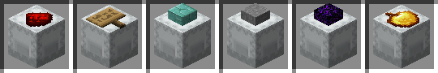

# Resource Packs

## Flat Shulker Icons

The built-in `Flat Shulker Icons` resource pack shows shulker boxes directly from the top.


**Without the `Flat Shulker Icons` resource pack**:



**With the `Flat Shulker Icons` resource pack**:


## Custom Resource Packs

You can create your own resource pack to customize the way items are rendered on shulker boxes.
Just add the override predicate `peek:shulker_item` to `1` in your item model.

Example item model override:
``` json{7}
{
  "parent": "minecraft:item/generated",
  "textures": {
    "layer0": "minecraft:item/golden_apple"
  },
  "overrides": [
    { "predicate": {  "peek:shulker_item": 1 }, "model": "item/golden_apple/custom_model"}
  ]
}
```
